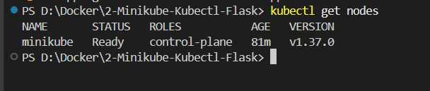
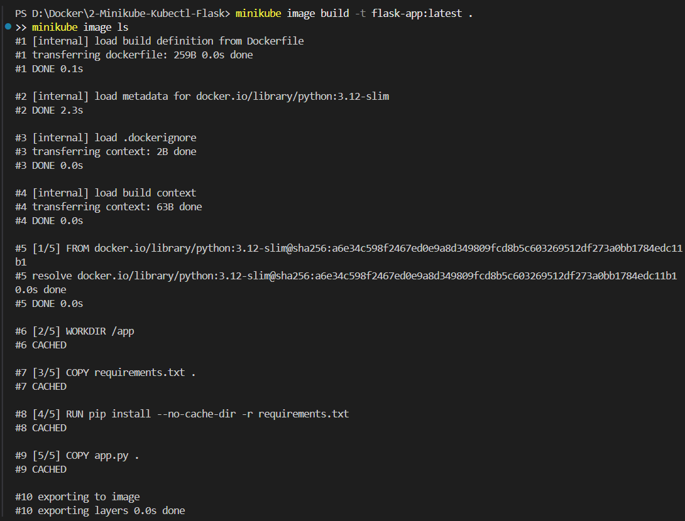
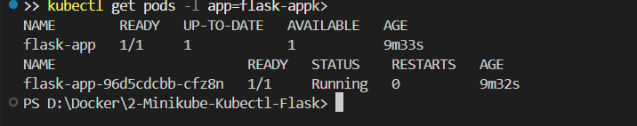
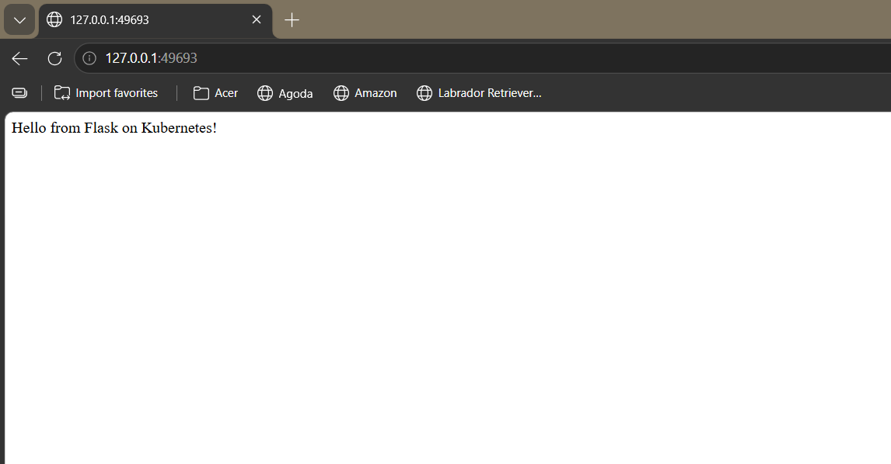

# Exercise 2: Deploy a Flask App on Minikube Using kubectl and YAML

## Business problem

Imagine you are a DevOps engineer asked to deploy a small Python web endpoint in a portable environment. This exercise packages a Flask app into a container image, deploys it to Kubernetes on Minikube, verifies its health, and exposes it through a NodePort Service.

## Objectives

- Start and inspect a local Minikube Kubernetes cluster.
- Build a Docker image for a Flask application.
- Deploy the image with a Kubernetes Deployment manifest.
- Verify the Deployment and Pod are healthy.
- Expose Flask through a Kubernetes NodePort Service.
- Open the endpoint in a browser and check the logs.

## Project structure

```text
2-Minikube-Kubectl-Flask/
├── README.md
├── app.py
├── requirements.txt
├── Dockerfile
├── .gitignore
├── k8s/
│   └── flask-deployment.yaml
└── images/
    ├── flask-deployment-pod-running.png
    ├── flask-image-built.png
    ├── flask-webpage.png
    ├── minikube-cluster-read.png
    └── README.md
```

## Prerequisites (Windows + VS Code)

Install and start Docker Desktop. Also install Minikube, kubectl, and Git. Restart VS Code after installation so its terminal can find the commands.

Verify the tools in the VS Code PowerShell terminal:

```powershell
docker version
minikube version
kubectl version --client
git --version
```

## Step 1 — Open the correct folder

Open this `2-Minikube-Kubectl-Flask` folder in VS Code. Open **Terminal → New Terminal**. Confirm you are in this folder by running:

```powershell
Get-Location
Test-Path .\app.py
Test-Path .\k8s\flask-deployment.yaml
```

Both `Test-Path` commands should return `True` before you continue.

## Step 2 — Start Minikube

```powershell
minikube start --driver=docker
minikube status
kubectl cluster-info
kubectl get nodes
```

Wait for the Minikube node to show `Ready`.

## Step 3 — Build the Flask image for Minikube

The source code is in `app.py`; the `Dockerfile` packages it into an image. From this exercise folder, run:

```powershell
minikube image build -t flask-app:latest .
minikube image ls
```

Check that `flask-app:latest` appears in the image list. This command builds the image where Minikube can use it, so you do not need to publish the image to Docker Hub for this local exercise.

## Step 4 — Deploy Flask to Kubernetes

Apply the manifest. It creates a Deployment and a NodePort Service:

```powershell
kubectl apply -f .\k8s\flask-deployment.yaml
kubectl rollout status deployment/flask-app --timeout=120s
```

## Step 5 — Verify the Deployment and Pod

```powershell
kubectl get deployments
kubectl get pods -l app=flask-app -o wide
kubectl describe deployment flask-app
kubectl logs deployment/flask-app
```

Expected result: Deployment `flask-app` should become `1/1` available, and its Pod should show `Running` with `1/1` ready. Logs should show Flask listening on `0.0.0.0:15000`.

## Step 6 — Check the Service

```powershell
kubectl get services
kubectl get service flask-app-service
```

The `flask-app-service` Service should have type `NodePort`, port `15000`, and a NodePort value in the `30000–32767` range.

## Step 7 — Open the Flask app

Try this command first:

```powershell
minikube service flask-app-service
```

The browser should display:

```text
Hello from Flask on Kubernetes!
```

If the browser does not open, use port-forwarding instead. Keep this terminal running while testing:

```powershell
kubectl port-forward service/flask-app-service 15000:15000
```

Then open <http://127.0.0.1:15000> in your browser. Stop port-forwarding with `Ctrl+C` when finished.

## Troubleshooting

- **`minikube` or `kubectl` not recognized:** Restart VS Code/PowerShell and verify the installation is on `PATH`.
- **Docker daemon error:** Start Docker Desktop and wait until its engine is ready, then retry `minikube start --driver=docker`.
- **Image not found / `ErrImageNeverPull`:** Confirm `minikube image build -t flask-app:latest .` completed successfully and was run from this exercise folder.
- **Pod does not become ready:** Run `kubectl describe pod -l app=flask-app` and `kubectl logs deployment/flask-app` to inspect events and logs.
- **Service exists but browser is unavailable:** Verify the Pod is ready, then use the port-forward command above.
- **Image or YAML changes:** Rebuild the image, then restart the Deployment with `kubectl rollout restart deployment/flask-app` if required.

## Screenshots and evidence

Save your screenshots in this folder's `images/` directory. The Markdown below references the exact image filenames already used in the `images` folder, except for the Flask Service screenshot, which keeps its Exercise 2 filename.

### 1. Minikube node ready


### 2. Flask image built


### 3. Flask Deployment and Pod running


### 4. Flask browser response


GitHub will display each image here when the corresponding file is committed to the repository. A NodePort service screenshot is not included yet.

## Commit and push to GitHub

If this folder is inside your existing DevOps exercises Git repository, return to that repository's root folder (the folder containing its main `README.md`) before running Git commands. For a first-time repository setup, initialize Git only once at the repository root.

To commit the exercise files from the repository root:

```powershell
git status
git add .
git commit -m "Add Minikube Flask Kubernetes exercise"
git push
```

If Git says there is no upstream branch, use `git push -u origin main`. If Git says `nothing to commit`, check that the files are saved and the screenshots are inside `images/`.

## Cleanup (optional)

Run from this exercise folder:

```powershell
kubectl delete -f .\k8s\flask-deployment.yaml --ignore-not-found
```

This removes the Deployment and Service but does not delete your Minikube cluster.

## Reference

Original exercise: <https://github.com/SunagP/DevOps-Lab/blob/main/Exercises/2-Minikube-Kubectl-Flask.md>
