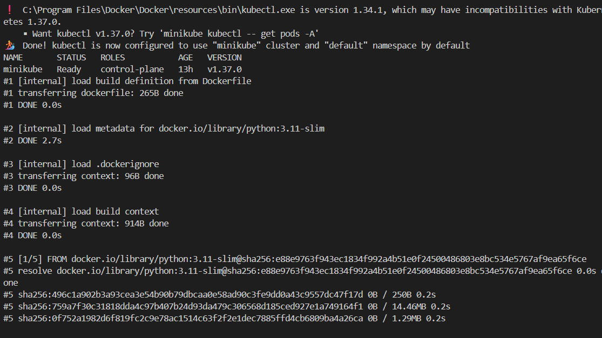
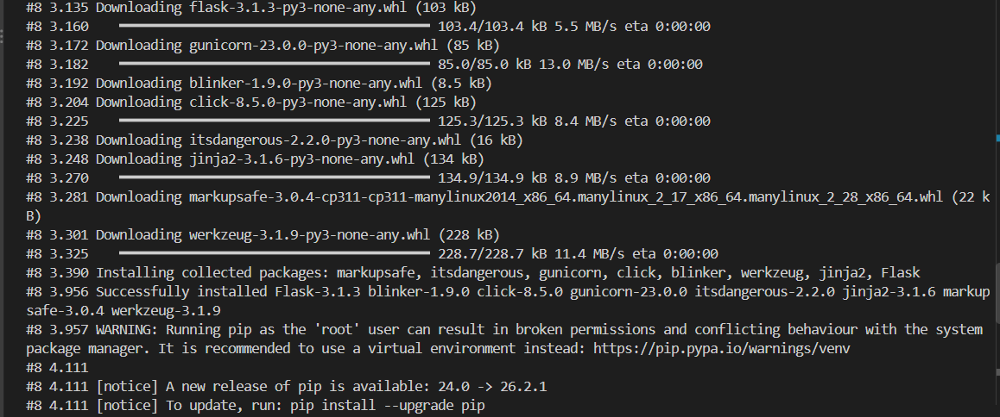
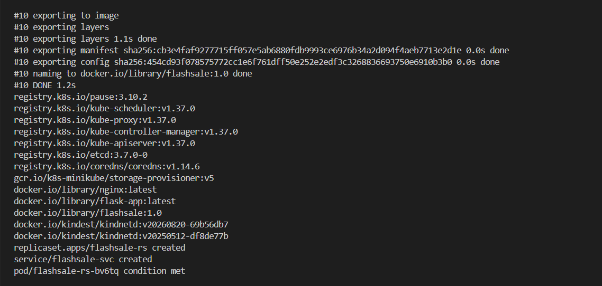
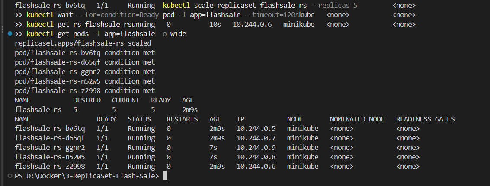

# Exercise 3: Scaling a Flask Flash-Sale App with a Kubernetes ReplicaSet

## Business use case

During an e-commerce flash sale, traffic can increase sharply. A ReplicaSet keeps the desired number of identical Flask Pods running. In this exercise, start with three replicas, scale to five, delete one Pod, and verify Kubernetes replaces it automatically.

## Objectives

- Understand ReplicaSets and Pods.
- Build a Flask container image for the local Minikube cluster.
- Start with three replicas and scale the ReplicaSet to five.
- Observe Pods and their node placement.
- Delete one Pod and verify the ReplicaSet creates a replacement.
- Access the `/`, `/buy`, and `/health` endpoints.

## Project structure

```text
3-ReplicaSet-Flash-Sale/
├── README.md
├── app.py
├── requirements.txt
├── Dockerfile
├── .dockerignore
├── .gitignore
├── k8s/
│   └── flashsale-replicaset.yaml
└── images/
    └── README.md
```

## Prerequisites

Install and start Docker Desktop. Install Minikube, kubectl, and Git. Open this folder in VS Code and choose **Terminal → New Terminal**.

Check that you are in the correct folder:

```powershell
Get-Location
Test-Path .\app.py
Test-Path .\k8s\flashsale-replicaset.yaml
```

Both `Test-Path` commands should return `True`.

Check your tools:

```powershell
docker version
minikube version
kubectl version --client
git --version
```

## Step 1 — Start and inspect Minikube

If Minikube is already running from your earlier exercises, you can reuse it. You do not need to delete the cluster.

```powershell
minikube start --driver=docker
minikube status
kubectl get nodes
```

Wait for the node to show `Ready`. This exercise expects one node; verify that with `kubectl get nodes`.

## Step 2 — Build the image for Minikube

Build the image directly into Minikube so the local cluster can use it without Docker Hub:

```powershell
minikube image build -t flashsale:1.0 .
minikube image ls
```

Check that `flashsale:1.0` appears in the image list. Run the build from the folder containing the `Dockerfile`.

## Step 3 — Create three replicas

Apply the ReplicaSet and Service manifest:

```powershell
kubectl apply -f .\k8s\flashsale-replicaset.yaml
kubectl get rs flashsale-rs
kubectl get pods -l app=flashsale -o wide
kubectl get service flashsale-svc
```

Wait until the three Pods are ready:

```powershell
kubectl wait --for=condition=Ready pod -l app=flashsale --timeout=120s
kubectl get rs flashsale-rs
kubectl get pods -l app=flashsale -o wide
```

Expected state: desired/current/ready replicas should be `3`, with three `Running` and ready Pods. The Service is named `flashsale-svc` and has type `ClusterIP`.

## Step 4 — Scale from three to five replicas

```powershell
kubectl scale replicaset flashsale-rs --replicas=5
kubectl wait --for=condition=Ready pod -l app=flashsale --timeout=120s
kubectl get rs flashsale-rs
kubectl get pods -l app=flashsale -o wide
```

Expected state: the ReplicaSet should show five desired and ready replicas. Because this exercise uses a single-node cluster, all five Pods will normally show the same node name in the `NODE` column. Pods have separate IP addresses and distinct generated names.

## Step 5 — Delete one Pod and observe self-healing

First list the Pods:

```powershell
kubectl get pods -l app=flashsale
```

Copy one actual Pod name from the output and replace `<POD_NAME>` below:

```powershell
kubectl delete pod <POD_NAME>
```

Then wait and inspect the ReplicaSet:

```powershell
kubectl wait --for=condition=Ready pod -l app=flashsale --timeout=120s
kubectl get rs flashsale-rs
kubectl get pods -l app=flashsale -o wide
```

Expected result: Kubernetes creates a replacement Pod and returns to five ready replicas. Use a real Pod name from your terminal; do not type the angle-bracket placeholder literally.

## Step 6 — Test the Flask endpoints

The Service is `ClusterIP`, so use a port-forward for local testing. Start this command in a terminal and leave it running:

```powershell
kubectl port-forward service/flashsale-svc 8080:80
```

Open these URLs in your browser:

- Home: <http://127.0.0.1:8080/>
- Buy simulation: <http://127.0.0.1:8080/buy?user=123>
- Health: <http://127.0.0.1:8080/health>

The `/buy` response contains a product, user, time, and `served_by_pod`. The `/health` endpoint is used by Kubernetes readiness and liveness probes. Stop port-forwarding with `Ctrl+C` when finished.

To inspect logs in another terminal:

```powershell
kubectl logs -l app=flashsale --prefix=true
```

Note: a `kubectl port-forward service/...` session forwards through a selected Pod, so it is good for testing that the app responds, but should not be used by itself to prove load balancing across all replicas. The core objective here is ReplicaSet scaling and automatic Pod replacement.

## Screenshots and evidence

The four screenshots below show the Minikube node becoming ready, the image build, ReplicaSet creation, and scaling to five running Pods. Two additional screenshots (automatic Pod replacement and the `/buy` endpoint) have not been captured yet.

### 1. Minikube node ready


### 2. Flash-sale image build progress


### 3. Image built and ReplicaSet created


### 4. ReplicaSet scaled to five Pods


Capture evidence: `kubectl get rs` showing five desired/current/ready replicas and `kubectl get pods -l app=flashsale -o wide` showing five running Pods.

Capture your own results for the Pod replacement and `/buy` endpoint, and save them using the filenames listed in [images/README.md](images/README.md).

## Questions and answers

**1. What is the initial number of replicas?** Three.

**2. How many Pods should be running immediately after the ReplicaSet settles?** Three.

**3. What happens when the ReplicaSet is scaled to five?** Kubernetes creates two additional Pods to reach the desired count of five.

**4. What happens when one Pod is deleted?** The ReplicaSet detects that there are fewer Pods than desired and creates a replacement.

**5. How does Kubernetes maintain the desired replica count?** The ReplicaSet controller continuously compares the actual matching Pods with the desired count and creates or deletes Pods as needed.

**6. How many nodes are running in this exercise?** One, as verified by `kubectl get nodes`.

**7. Where do the Pods run?** All five Pods are scheduled on the single Minikube node. `kubectl get pods -o wide` shows their node placement.

## Troubleshooting

- **`ErrImagePull` or `ImagePullBackOff`:** rebuild with `minikube image build -t flashsale:1.0 .` from this folder, and confirm the manifest image name is `flashsale:1.0`.
- **Pods are not ready:** run `kubectl describe pod -l app=flashsale` and `kubectl logs -l app=flashsale --prefix=true`.
- **Manifest cannot be found:** confirm you are in this project folder and run `Test-Path .\k8s\flashsale-replicaset.yaml`.
- **Port-forward fails:** check `kubectl get pods -l app=flashsale` and `kubectl get service flashsale-svc` before retrying.

## Commit and push to GitHub

If this folder belongs inside an existing Git repository, run Git commands from that repository's root (the folder containing the repository's `.git` directory and main README). From the repository root, use:

```powershell
git status
git add .\3-ReplicaSet-Flash-Sale\
git commit -m "Add ReplicaSet flash-sale exercise"
git push
```

If the folder itself is a standalone repository, initialize and configure its remote only if that is what you intend. Do not run `git init` repeatedly or push from a folder that is not inside the repository.

## Cleanup (optional)

Run from this exercise folder:

```powershell
kubectl delete -f .\k8s\flashsale-replicaset.yaml
```

This deletes the ReplicaSet and Service created by this exercise, but leaves the Minikube cluster running.
