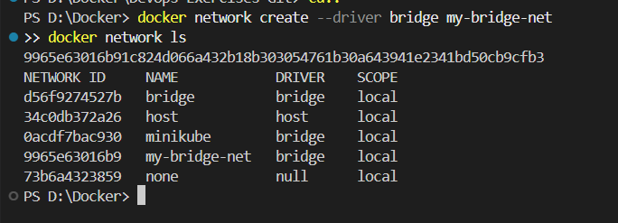
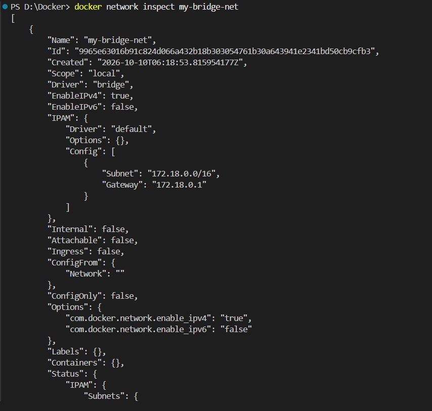
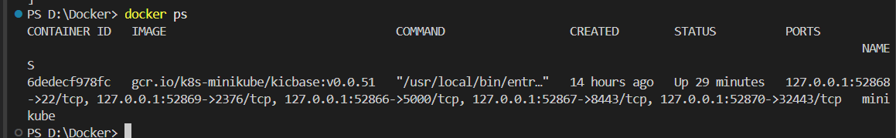
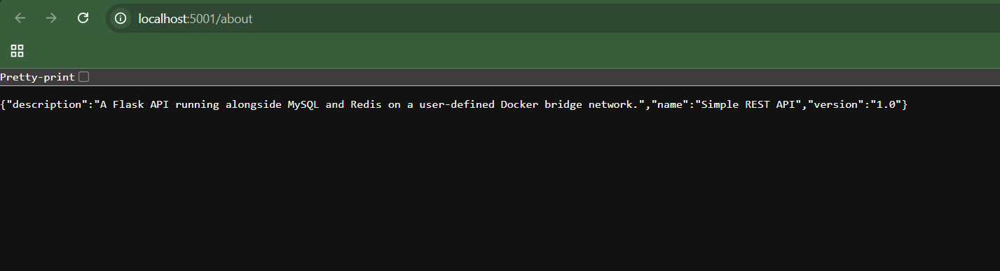
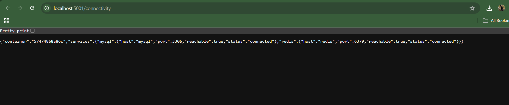

# Exercise 4: Docker Networking with Multiple Containers

## Objective

Create a user-defined Docker bridge network and run three containers on it:

- **Flask** — a small REST API exposed on local port `5001`.
- **MySQL** — a database container listening on port `3306` inside the Docker network.
- **Redis** — a cache container listening on port `6379` inside the Docker network.

The purpose of this exercise is to understand how containers on the same user-defined bridge network can discover one another by container name and communicate over container ports.

## Project structure

```text
4-Docker-Networking/
├── README.md
├── app.py
├── requirements.txt
├── Dockerfile
├── .dockerignore
├── .gitignore
└── images/
    └── README.md
```

## Prerequisites (Windows + VS Code)

1. Install Docker Desktop and wait until the Docker engine is running.
2. Open this folder in VS Code.
3. Open **Terminal → New Terminal** and verify:

```powershell
docker version
docker info
```

If `docker version` cannot connect to the Docker daemon, start Docker Desktop before continuing.

## Step 1 — Create a bridge network

From this exercise folder, run:

```powershell
docker network create --driver bridge my-bridge-net
docker network ls
docker network inspect my-bridge-net
```

In `docker network ls`, confirm that `my-bridge-net` appears with driver `bridge`. The network inspection initially may show no connected containers.

## Step 2 — Build the Flask API image

```powershell
docker build -t flask-api:1.0 .
docker image ls flask-api
```

The Flask API runs on port `5001` and provides `/`, `/about`, `/health`, and `/connectivity` endpoints. The connectivity endpoint checks whether the `mysql:3306` and `redis:6379` addresses can be reached from inside the Flask container.

## Step 3 — Start MySQL and Redis

Run these commands one at a time. MySQL needs a root password in order to initialize.

```powershell
docker run -d --name mysql --network my-bridge-net -e MYSQL_ROOT_PASSWORD=LabRoot123! -e MYSQL_DATABASE=labdb mysql:8.4
docker run -d --name redis --network my-bridge-net redis:7-alpine
```

Check the containers:

```powershell
docker ps
docker logs --tail 20 mysql
docker logs --tail 20 redis
```

MySQL may take a short time to initialize. Wait until its logs indicate it is ready for connections before testing `/connectivity`.

## Step 4 — Start the Flask container

```powershell
docker run -d --name flask --network my-bridge-net -p 5001:5001 flask-api:1.0
docker ps
docker network inspect my-bridge-net
```

The `-p 5001:5001` option maps port `5001` on your computer to port `5001` in the Flask container. MySQL and Redis are not published to the host in this exercise; Flask reaches them through the private bridge network.

## Step 5 — Test the API in a browser

Open these URLs:

- `http://localhost:5001/` — API welcome message.
- `http://localhost:5001/about` — app name, version, and description.
- `http://localhost:5001/health` — health response.
- `http://localhost:5001/connectivity` — TCP reachability checks for MySQL and Redis.

Or run in PowerShell:

```powershell
Invoke-RestMethod http://localhost:5001/about
Invoke-RestMethod http://localhost:5001/health
Invoke-RestMethod http://localhost:5001/connectivity
```

On `/connectivity`, look for `"reachable": true` for MySQL and Redis. If MySQL is still starting, retry the endpoint after a short wait.

## Step 6 — Verify container-name connectivity

Check that all three containers are on the same network:

```powershell
docker network inspect my-bridge-net
docker inspect flask --format '{{json .NetworkSettings.Networks}}'
```

You can also run a one-off diagnostic container on the same network. It uses Python sockets, so it does not depend on `ping` being installed:

```powershell
docker run --rm --network my-bridge-net python:3.11-slim python -c "import socket; print('mysql:', socket.gethostbyname('mysql')); print('redis:', socket.gethostbyname('redis'))"
```

View Flask logs:

```powershell
docker logs flask
```

## Troubleshooting

- **Docker daemon unavailable:** start Docker Desktop and retry `docker version`.
- **Network already exists:** if you are re-running the lab, reuse `my-bridge-net` or remove old resources using the cleanup steps below first.
- **Container name already in use:** a prior run may have left a container. Use `docker ps -a` to inspect it, then remove only the exercise containers if you intend to recreate them.
- **MySQL reports `reachable: false`:** wait for MySQL initialization, then check `docker logs mysql` and retry `/connectivity`.
- **Flask is unavailable in the browser:** run `docker ps`, `docker logs flask`, and confirm that port `5001` is not already being used by another process.
- **A container cannot resolve `mysql` or `redis`:** inspect `docker network inspect my-bridge-net` and ensure all three containers are connected to that network.

## Screenshots and evidence

Capture actual output from your own terminal/browser and save the files in `images/` using these names. GitHub will render them here after you commit and push the images.

### 1. Bridge network created


### 2. Network inspected


### 3. MySQL, Redis, and Flask containers running


### 4. Flask About endpoint


### 5. Container connectivity


## Questions and answers

1. **What does `--network my-bridge-net` do?** It connects a container to the specified Docker network.
2. **How do containers communicate on a user-defined bridge network?** Docker provides network isolation and name-based DNS, so one container can connect to another using its container name and listening port.
3. **What is the difference between bridge and host networking?** A bridge network provides an isolated container network with its own addressing. Host networking shares the host's network namespace where supported; port publishing works differently or may be unnecessary in host mode.
4. **How is a container port exposed to the host?** Use `-p HOST_PORT:CONTAINER_PORT`, for example `-p 5001:5001`.
5. **Why do MySQL and Redis not need `-p` in this exercise?** The Flask container accesses them over the shared bridge network. Host port publishing is not required for container-to-container communication.

## Cleanup (optional)

When you are finished, remove these exercise containers and network:

```powershell
docker rm -f flask mysql redis
docker network rm my-bridge-net
```

This removes the named exercise containers and bridge network. It does not remove the built `flask-api:1.0` image. Only run cleanup when you no longer need these containers.

## Push this exercise to GitHub

If this folder is part of your existing DevOps exercises repository, copy `4-Docker-Networking` into that repository beside the other exercise folders. Then run Git commands from the repository root:

```powershell
git status
git add .\4-Docker-Networking\
git commit -m "Add Exercise 4 Docker networking"
git push
```

If you are setting up a separate repository for the first time, initialize Git and configure its remote once at the intended repository root.

## Reference

Original exercise: [Docker Networking with Multiple Containers](https://github.com/SunagP/DevOps-Lab/blob/main/Exercises/4-Docker-Networking.md#docker-networking-with-multiple-containers)
