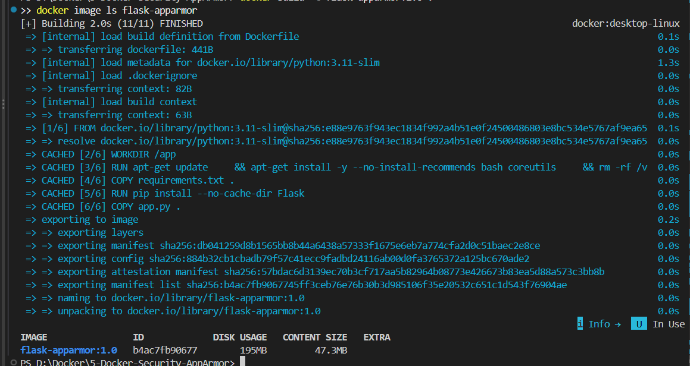

# Exercise 5: Docker Security with AppArmor and Python

## Objective

Containerize a small Flask service, load a custom AppArmor profile on a Linux Docker host, run the container with that profile, inspect the profile settings through the Docker SDK, and test restricted operations.

## Important: Windows / Docker Desktop limitation

AppArmor is a Linux kernel security module. Writing code in VS Code on Windows is fine, but **loading and enforcing this profile requires a Linux host/kernel with AppArmor enabled and a Docker daemon that supports it**. Docker Desktop's Windows PowerShell environment may not expose AppArmor to its Linux engine. For the AppArmor tasks, use Ubuntu (physical machine or VM) with Docker Engine running on that Ubuntu host, or a suitable Linux environment where `docker info` lists AppArmor. If Docker reports no AppArmor security option, stop here and use a supported Linux host; the custom profile cannot be enforced by this setup.

## Project structure

```text
5-Docker-Security-AppArmor/
├── README.md
├── app.py
├── Dockerfile
├── requirements.txt
├── my-apparmor-profile
├── apply_apparmor.py
├── test_restricted_actions.py
└── images/
    └── README.md
```

## 1. Check the Linux and Docker prerequisites

Open a terminal on the Ubuntu/Linux machine that runs Docker Engine. From the project folder, run:

```bash
sudo apt-get update
sudo apt-get install -y apparmor apparmor-utils python3-venv python3-pip
sudo aa-status
docker version
docker info | grep -i apparmor
```

Continue only if AppArmor is loaded and Docker's security options include AppArmor. Make sure your user can access Docker (for example, `docker ps` succeeds); otherwise follow your system administrator's usual Docker permissions setup.

## 2. Build the Flask image

```bash
docker build -t flask-apparmor:1.0 .
docker image ls flask-apparmor
```

## 3. Run the app with Docker's default profile first (optional baseline)

```bash
docker run --rm -d --name flask-baseline -p 5000:5000 flask-apparmor:1.0
curl http://127.0.0.1:5000/
docker inspect --format '{{json .AppArmorProfile}}' flask-baseline
docker rm -f flask-baseline
```

The response should say: `Hello, this is a secure Flask application running inside a Docker container!`

## 4. Load the custom AppArmor profile

Copy the profile into the standard profile directory, then load it:

```bash
sudo install -m 0644 my-apparmor-profile /etc/apparmor.d/my-apparmor-profile
sudo apparmor_parser -r -W /etc/apparmor.d/my-apparmor-profile
sudo aa-status | grep -F my-apparmor-profile
```

If profile loading reports a syntax error, do not continue to the protected-container steps; fix the profile error first. Profile syntax/available permissions may vary by Linux distribution. The profile is a teaching example and should be reviewed and tested before any production use.

## 5. Run Flask with the custom profile

```bash
docker run -d --name flask-apparmor -p 5000:5000 \
  --security-opt apparmor=my-apparmor-profile flask-apparmor:1.0
curl http://127.0.0.1:5000/
docker inspect --format '{{json .HostConfig.SecurityOpt}}' flask-apparmor
docker ps --filter name=flask-apparmor
```

The inspect output should include `apparmor=my-apparmor-profile`. If the container exits or fails to start, inspect it with `docker logs flask-apparmor` and check kernel/AppArmor logs; a restrictive profile can block application startup if required file permissions are missing.

When done with the manual container:

```bash
docker rm -f flask-apparmor
```

## 6. Verify AppArmor through the Docker SDK for Python

Create and activate a virtual environment so pip does not modify system Python packages:

```bash
python3 -m venv .venv
source .venv/bin/activate
python -m pip install --upgrade pip
python -m pip install -r requirements.txt
python apply_apparmor.py
```

The script builds the image, starts a temporary container with the profile, prints the container security options, and removes the container afterward.

## 7. Test restricted actions

With the profile loaded, run:

```bash
python test_restricted_actions.py
```

The script attempts to read `/etc/passwd` and execute `/bin/bash`. A correctly enforced custom profile should deny these actions. The exact error message and exit code can differ across environments, so record your actual output rather than expecting a byte-for-byte match to sample output.

## 8. Endpoints

While the manually started container is running, open:

- Home page: <http://127.0.0.1:5000/>
- Health check: <http://127.0.0.1:5000/health>

## Screenshots and evidence

The following screenshots have been added from the results you supplied:

### 2. Flask image built


### 5. Docker SDK profile verification


### 6. Restricted actions test


The other screenshot slots still need genuine output captured from your own environment:

1. **`01-apparmor-status.png`** — capture `sudo aa-status` and `docker info` showing AppArmor support.
2. **`03-apparmor-profile-loaded.png`** — capture the real Ubuntu terminal after `sudo aa-status | grep -F my-apparmor-profile` confirms the profile is loaded.
3. **`04-secure-flask-container-running.png`** — capture `docker ps` and the container security options showing the custom profile is applied.

Save those files in `images/` using the exact names above. A generated/reference terminal image is not a substitute for genuine execution evidence. Note: the supplied restricted-actions screenshot shows the attempted read and shell execution succeeded (exit code 0), so it does not demonstrate that those actions were blocked. Review the profile and re-run the test before claiming successful restriction.

Image links will display on GitHub after the image files are committed. Use actual screenshots captured from your own machine; do not present reference images as execution proof.

## Questions and answers

1. **What is the purpose of AppArmor with Docker?** AppArmor enforces mandatory access-control rules that limit what a container process can access or execute.
2. **How do profiles secure containers?** They define allowed and denied access to paths, capabilities, and some resource operations for confined processes.
3. **Why restrict `/etc/` and `/var/`?** They can contain configuration, credentials, logs, and other sensitive system data; access should be limited to what the application requires.
4. **What capabilities can be restricted?** A policy can deny capabilities such as `sys_admin`, which is powerful and generally unnecessary for a simple web service.
5. **How can you verify a profile is applied?** Inspect the container's `HostConfig.SecurityOpt`, inspect the active AppArmor profile using system tools, and test a controlled operation that the profile denies.

## Troubleshooting

- **`apparmor_parser: command not found`:** install `apparmor-utils` on Ubuntu/Debian.
- **Docker does not list AppArmor:** use a Linux Docker host whose kernel/runtime supports AppArmor; Docker Desktop on Windows may not expose this feature.
- **`apparmor_parser` reports syntax errors:** correct the profile based on the exact parser message before running the container.
- **Container exits after applying profile:** inspect `docker logs flask-apparmor` and the Linux kernel/AppArmor audit logs; add only the minimum required allow rules.
- **Docker SDK cannot connect:** check `docker version`, Docker daemon status, and user permissions.

## Push to your existing GitHub repository

Copy this folder into your existing cloned DevOps repository alongside Exercises 1–4. Run the following commands **from the root of that existing Git repository**, not from this exercise folder if it is not itself a Git repo:

```bash
git status
git add ./5-Docker-Security-AppArmor
git commit -m "Add Exercise 5 Docker AppArmor security"
git push
```

If `git push` says the remote has newer commits, use `git pull --rebase origin main` and then `git push` after resolving any conflicts.

## Reference

Original exercise: <https://github.com/SunagP/DevOps-Lab/blob/main/Exercises/5-Docker-Security-AppArmor.md>

Official Docker AppArmor documentation: <https://docs.docker.com/engine/security/apparmor/>
