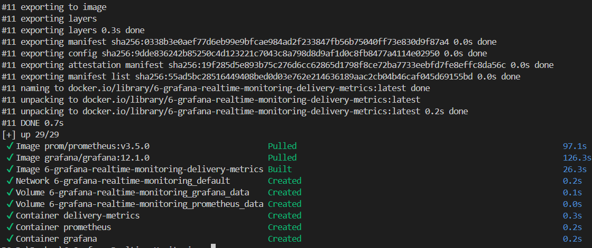
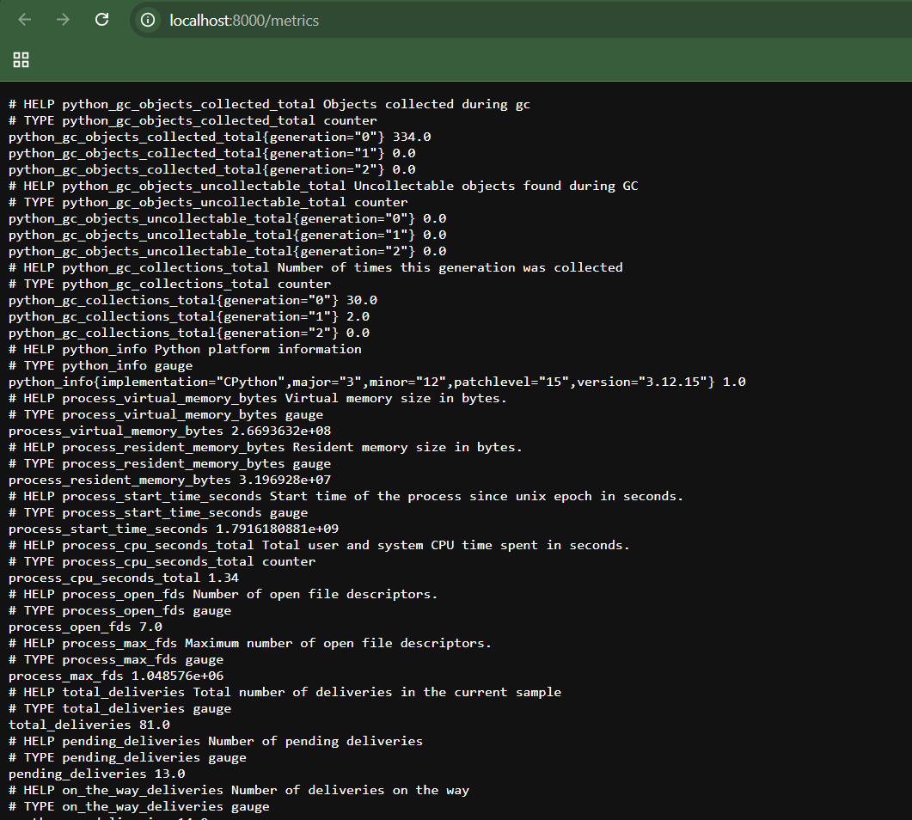
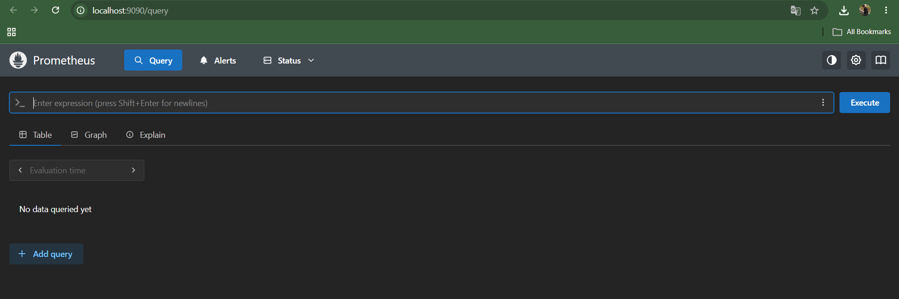
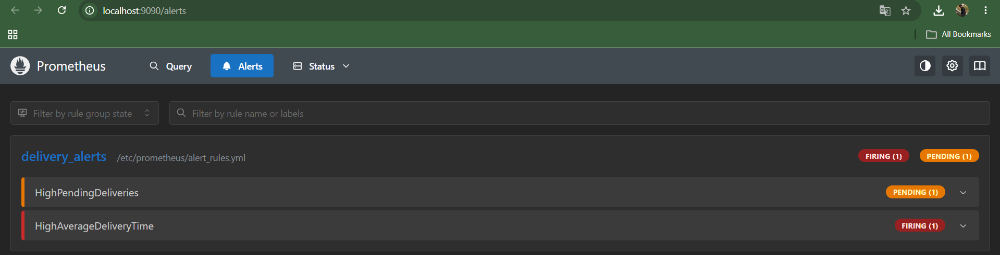
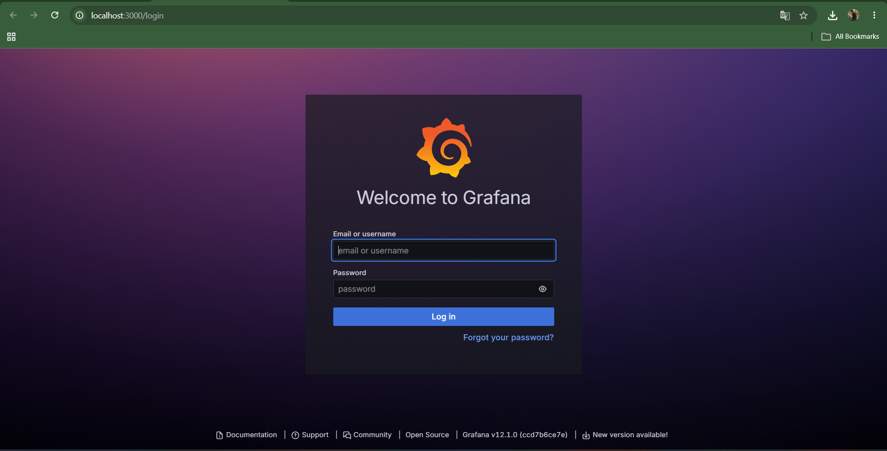
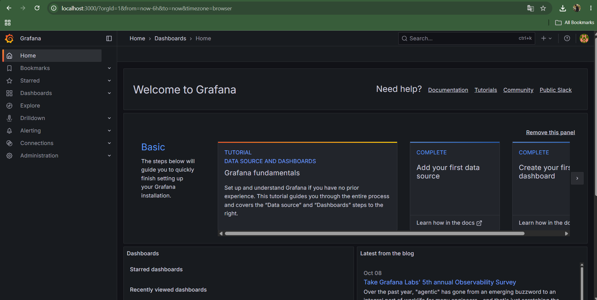

# Exercise 6: Grafana Real-Time Monitoring of a Quick-Commerce App

## Scenario

Act as a DevOps engineer for a quick-commerce delivery service. This project simulates delivery metrics, exposes them for Prometheus, visualizes them in Grafana, defines alert rules, and includes a Jenkins pipeline for validation and image building.

## Project structure

```text
6-Grafana-Realtime-Monitoring/
├── delivery_metrics.py
├── requirements.txt
├── Dockerfile
├── docker-compose.yml
├── Jenkinsfile
├── prometheus/
│   ├── prometheus.yml
│   └── alert_rules.yml
├── grafana/
│   ├── provisioning/
│   │   ├── datasources/prometheus.yml
│   │   └── dashboards/dashboard-provider.yml
│   └── dashboards/delivery-monitoring.json
└── images/
```

## Prerequisites

- Docker Desktop installed and running
- VS Code (recommended)
- A browser
- Jenkins is optional for the main Docker Compose demonstration; the included `Jenkinsfile` assumes a Linux Jenkins agent with Docker CLI access to a Docker daemon

## Step 1 — Open the project in VS Code

Extract the ZIP, open the `6-Grafana-Realtime-Monitoring` folder, then open **Terminal → New Terminal**. Verify you are in the correct directory:

```powershell
Get-Location
Test-Path .\delivery_metrics.py
Test-Path .\docker-compose.yml
```

Both `Test-Path` commands should return `True`.

## Step 2 — Start the monitoring stack

From the project folder, run:

```powershell
docker compose up -d --build
docker compose ps
```

This starts the Python metrics exporter, Prometheus, and Grafana. The first start may take some time while Docker downloads images.

## Step 3 — Verify the metrics endpoint

Open this URL in your browser:

- [Metrics endpoint](http://localhost:8000/metrics)

You should see metrics such as `total_deliveries`, `pending_deliveries`, and `on_the_way_deliveries`. You can also run:

```powershell
Invoke-WebRequest http://localhost:8000/metrics | Select-Object -ExpandProperty Content
```

## Step 4 — Verify Prometheus

Open [Prometheus](http://localhost:9090). Go to **Status → Targets** and confirm that `delivery_service` is `UP`. You can try these expressions in the query page:

```promql
total_deliveries
pending_deliveries
on_the_way_deliveries
rate(average_delivery_time_sum[1m]) / rate(average_delivery_time_count[1m])
```

Prometheus loads alert rules from `prometheus/alert_rules.yml`. `HighPendingDeliveries` can fire when pending deliveries remain above 10. `HighAverageDeliveryTime` can fire when the observed average exceeds 30 seconds.

## Step 5 — Open Grafana dashboard

Open [Grafana](http://localhost:3000). Default local lab credentials are:

- Username: `admin`
- Password: `admin`

Change the default password if prompted. The Prometheus data source and the **Quick Commerce Delivery Monitoring** dashboard are provisioned automatically. Open **Dashboards → Quick Commerce** and view the panels for total deliveries, pending deliveries, on-the-way deliveries, and average delivery time.

## Step 6 — Inspect alerts

Open [Prometheus Alerts](http://localhost:9090/alerts). You may see rules in `Inactive`, `Pending`, or `Firing` state depending on the current simulated values and how long the stack has been running. The sample simulator intentionally sets pending deliveries in a range that can trigger the warning rule.

## Step 7 — Optional Jenkins pipeline

The included `Jenkinsfile` validates Python syntax, builds the delivery metrics image, and checks the Prometheus configuration. To use it, configure a Jenkins Pipeline job pointing at this repository and ensure the Jenkins agent is Linux-based with Python 3, Docker CLI connected to a working Docker daemon, and permission to run Docker commands. A basic Jenkins container alone does not automatically have Docker daemon access.

You can optionally start a Jenkins container for exploration with:

```powershell
docker compose --profile ci up -d jenkins
```

Then open [Jenkins](http://localhost:8080). The pipeline will not run successfully until its agent has the prerequisites described above.

## Step 8 — Screenshots and evidence

Take screenshots of your own successful run and save them in `images/` using these names. Do not use sample images as execution evidence.

### 1. Monitoring stack running

`images/01-monitoring-stack-running.png`

Capture `docker compose ps` showing `delivery-metrics`, `prometheus`, and `grafana` running.

### 2. Metrics endpoint

`images/02-delivery-metrics-endpoint.png`

Capture `http://localhost:8000/metrics` showing the delivery metrics.

### 3. Prometheus target healthy

`images/03-prometheus-targets-up.png`

Capture Prometheus **Status → Targets**, with `delivery_service` marked `UP`.

### 4. Prometheus alerts

`images/04-prometheus-alerts.png`

Capture `http://localhost:9090/alerts` showing the configured delivery alert rules.

### 5. Grafana dashboard

`images/05-grafana-delivery-dashboard.png`

Capture the provisioned dashboard with its delivery panels displaying data.

### 6. Jenkins pipeline (optional)

`images/06-jenkins-pipeline-success.png`

Capture the Jenkins build stages after you configure and run the pipeline successfully.

Once you create those screenshots, their links will render here:













## Troubleshooting

- **A port is already in use:** stop the conflicting container or change the host-side port in `docker-compose.yml`.
- **Prometheus target is down:** check `docker compose logs delivery-metrics prometheus`; the Compose configuration uses the service DNS name `delivery-metrics:8000`, not a host-only IP.
- **Grafana has no data:** check Prometheus **Status → Targets** first. Make sure the delivery service is `UP`, then refresh the dashboard.
- **Compose fails to parse:** confirm you run `docker compose` from the folder containing `docker-compose.yml`.
- **Jenkins cannot run Docker:** the Jenkinsfile requires Docker CLI and access to the Docker daemon on its agent; this is separate from starting the Jenkins web container.

## Cleanup

To stop and remove the containers and network created by Compose:

```powershell
docker compose down
```

To also delete stored Prometheus and Grafana data, use `docker compose down -v` (this removes the named data volumes).

## Reference

Original exercise: https://github.com/SunagP/DevOps-Lab/blob/main/Exercises/6-Grafana-Realtime-Monitoring-of-Quick-Commerce-App.md
