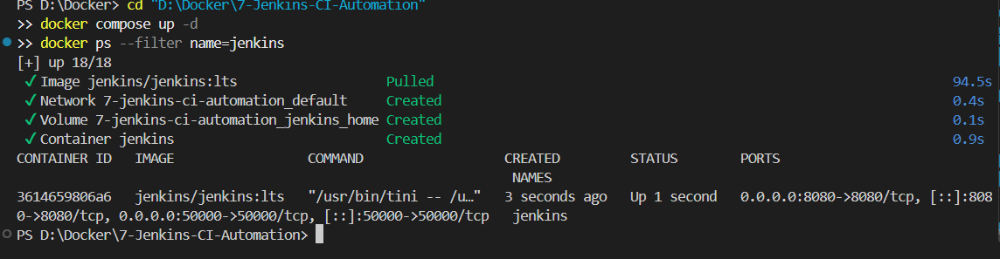
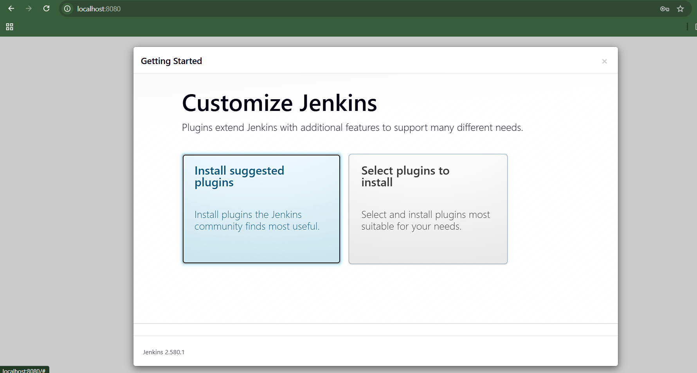
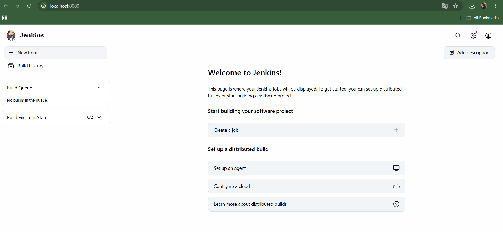
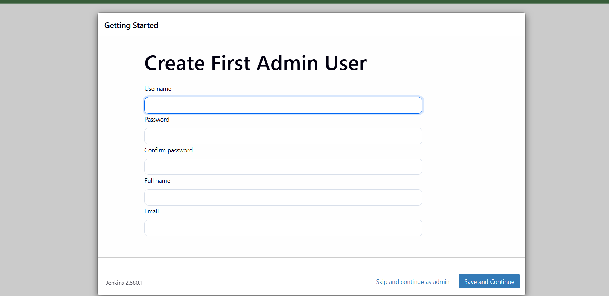

# Exercise 7: Jenkins CI Automation

## Objective
Install Jenkins in Docker, complete the first-run setup, and run a sample CI pipeline that demonstrates automated stages.

## Project structure

```text
7-Jenkins-CI-Automation/
├── README.md
├── docker-compose.yml
├── Jenkinsfile
└── images/
    └── README.md
```

## Prerequisites (Windows + VS Code)

- Docker Desktop installed and running in Linux-container mode.
- Git installed (for pushing this folder to GitHub).
- A browser.

Open this folder in VS Code, then open **Terminal → New Terminal**. Confirm you are in the exercise folder:

```powershell
Get-Location
Test-Path .\docker-compose.yml
Test-Path .\Jenkinsfile
```

Both `Test-Path` commands should return `True`.

## Step 1 — Start Jenkins

From this folder run:

```powershell
docker compose up -d
 docker ps --filter name=jenkins
```

If Docker says a container named `jenkins` already exists, check it first with `docker ps -a --filter name=jenkins`. Do not remove an existing Jenkins container if it contains work you need. You can either continue using that running container or back up its data before replacing it.

The first startup can take a few minutes. Check the logs with:

```powershell
docker logs -f jenkins
```

Press `Ctrl+C` to stop following logs; this does not stop Jenkins.

## Step 2 — Get the initial unlock password

Run this command in PowerShell:

```powershell
docker exec jenkins cat /var/jenkins_home/secrets/initialAdminPassword
```

Copy the password into the Jenkins setup page. **Do not commit or publish this password or a screenshot that reveals it.** If you need evidence of this step, take a screenshot with the secret hidden.

## Step 3 — Complete browser setup

1. Open <http://localhost:8080>.
2. Enter the initial administrator password.
3. Select **Install suggested plugins** and wait for the installation to finish.
4. Create your own administrator account and complete the instance configuration.
5. Confirm the Jenkins dashboard loads.

The Docker Compose file stores Jenkins data in the named volume `jenkins_home`, so your setup survives a container restart.

## Step 4 — Run a sample CI pipeline

This project includes a sample `Jenkinsfile` with Build, Test, and Package stages. To run it:

1. In Jenkins, select **New Item**.
2. Enter `devops-ci-demo`, select **Pipeline**, and click **OK**.
3. Under **Pipeline**, set **Definition** to **Pipeline script**.
4. Open this project's `Jenkinsfile` in VS Code and copy its contents into the script box.
5. Click **Save**, then select **Build Now**.
6. Open the build number, then **Console Output**. The build should finish with `Finished: SUCCESS`.

The sample pipeline uses shell commands available inside the Linux Jenkins container and does not require a separate application runtime. The stages demonstrate pipeline flow; the Package stage is an example message, not a production artifact upload.

## Step 5 — Screenshots and evidence

The following screenshots have been added to this project’s `images/` folder. The links use the exact filenames, so GitHub will display each image when the folder is pushed.

### 1. Jenkins container running


### 2. Jenkins plugin selection


### 3. Create first administrator user


### 4. Jenkins dashboard


### Additional evidence after running the sample pipeline

After completing the pipeline in Step 4, capture and add these two screenshots using the filenames below. They are not included yet because they must show the result of your own pipeline run.

#### 5. Pipeline stages completed


#### 6. Pipeline console output


**Security note:** Never publish the initial administrator password, access tokens, or other secrets in screenshots.

## Useful commands

```powershell
# Show container status
docker ps --filter name=jenkins

# Follow Jenkins logs
docker logs -f jenkins

# Restart the container
docker restart jenkins

# Stop Jenkins without deleting its stored data
docker compose down

# Start it again
docker compose up -d
```

Avoid `docker compose down -v` unless you intentionally want to delete the `jenkins_home` volume and all Jenkins configuration/jobs stored in it.

## Commit and push to GitHub

If this folder is part of your existing `DevOps-Exercises-Git` repository, copy it into that repository and run these commands from the repository root:

```powershell
git status
git add .\7-Jenkins-CI-Automation\
git commit -m "Add Exercise 7 Jenkins CI automation"
git pull --rebase origin main
git push origin main
```

If Git says `nothing to commit`, check that the updated files and screenshots were copied into the cloned repository. If `git pull --rebase` reports conflicts, stop and resolve them before pushing; do not force-push.

## Reference

Original exercise: <https://github.com/SunagP/DevOps-Lab/blob/main/Exercises/7-Jenkins-CI-Automation.md>
