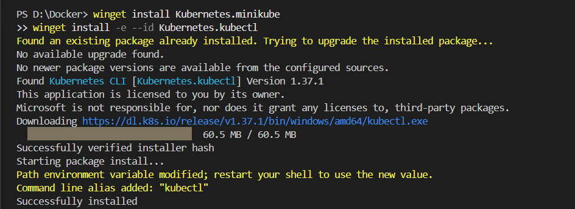

# Kubernetes Hands-On Exercise 1: Hello Pod

Next: [Exercise 2 — Deploy a Flask App on Minikube](2-Minikube-Kubectl-Flask/README.md).

Also see [Exercise 3 — Scale a Flask Flash-Sale App with a ReplicaSet](3-ReplicaSet-Flash-Sale/README.md).

## Business problem

Imagine you are a DevOps engineer at Zepto. The product team needs a lightweight storefront/status web page that can run in a portable environment and be managed by Kubernetes. For this exercise, use the official Nginx container image as the sample web application.

## Objective

- Start a local Kubernetes cluster with Minikube.
- Run an Nginx Pod named `hello-k8s`.
- Verify that the Pod is running.
- Expose it through a NodePort Service.
- Open the Nginx welcome page in a browser.

## Project structure

```text
kubernetes-getting-started/
├── README.md
├── .gitignore
├── k8s/
│   ├── pod.yaml
│   └── service.yaml
└── screenshots/
    └── README.md
```

## Prerequisites (Windows + VS Code)

1. Install and start **Docker Desktop**. Keep it running while you use Minikube.
2. Install Minikube and `kubectl`. If you use Windows Package Manager (`winget`), open PowerShell and run:

   ```powershell
   winget install Kubernetes.minikube
   winget install -e --id Kubernetes.kubectl
   ```

3. Close and reopen VS Code after installing tools, then open **Terminal → New Terminal** and confirm the tools are available:

   ```powershell
   minikube version
   kubectl version --client
   docker version
   ```

Minikube needs a container or VM driver. This guide uses Docker as the driver. If Docker is unavailable, start Docker Desktop and wait until its engine is running before continuing.

## Step 1 — Start Kubernetes

Run in the VS Code terminal:

```powershell
minikube start --driver=docker
kubectl cluster-info
kubectl get nodes
```

Wait until the Minikube node shows `Ready` before moving on.



## Step 2 — Deploy Nginx

Choose **one** of the following approaches. Both create the same Pod and Service, so do not run both on top of each other.

### Option A: Use the exact commands from the exercise

```powershell
kubectl run hello-k8s --image=nginx --port=80
kubectl get pods
kubectl wait --for=condition=Ready pod/hello-k8s --timeout=120s
kubectl expose pod hello-k8s --type=NodePort --port=80
kubectl get services
minikube service hello-k8s
```

The last command opens the Service in your default browser. You should see the **Welcome to nginx!** page.


### Option B: Apply the YAML files in this repository

This is the declarative Kubernetes approach, and it is useful for keeping configuration in GitHub.

```powershell
kubectl apply -f k8s/pod.yaml
kubectl get pods
kubectl wait --for=condition=Ready pod/hello-k8s --timeout=120s
kubectl apply -f k8s/service.yaml
kubectl get services
minikube service hello-k8s
```

If you already created the Pod and Service using Option A, either keep using that setup or delete those resources before switching to Option B:

```powershell
kubectl delete service hello-k8s --ignore-not-found
kubectl delete pod hello-k8s --ignore-not-found
```

## Step 3 — Verify the deployment

Run:

```powershell
kubectl get pods -o wide
kubectl get service hello-k8s
kubectl describe pod hello-k8s
kubectl logs hello-k8s
```

Expected results:

- The `hello-k8s` Pod reaches `Running` and `Ready`.
- The `hello-k8s` Service has type `NodePort` and exposes port `80`.
- The browser displays the Nginx welcome page.

If `minikube service hello-k8s` does not open a browser, you can use port-forwarding in a terminal:

```powershell
kubectl port-forward service/hello-k8s 8080:80
```

Keep that terminal open, then visit <http://127.0.0.1:8080>.

## Troubleshooting

- **`minikube` or `kubectl` is not recognized:** restart VS Code/PowerShell after installation and check that the tool is on `PATH`.
- **Docker daemon/driver error:** open Docker Desktop, wait for it to finish starting, then run `minikube start --driver=docker` again.
- **Pod is `ImagePullBackOff` or `ContainerCreating`:** check your internet connection and run `kubectl describe pod hello-k8s`.
- **Service opens but page is unavailable:** verify the Pod is `Running`, check `kubectl get service hello-k8s`, then try the port-forward command above.
- **Need to recreate the local cluster:** run `minikube delete` and then `minikube start --driver=docker`. This deletes the local Minikube cluster and its resources.


## Step 4 — Save evidence for submission

Capture screenshots showing:

1. `kubectl get pods` with `hello-k8s` running.
2. `kubectl get services` showing the NodePort Service.
3. The browser displaying the Nginx welcome page.

Save the images in the `screenshots/` folder before pushing, if your instructor requires screenshots. See `screenshots/README.md` for suggested filenames.

## Step 5 — Push this project to your GitHub repository

Create an **empty repository** on GitHub first (for example, `kubernetes-getting-started`). Do not initialize it with a README if you plan to push this existing folder as-is.

In VS Code, open this project folder, select **Terminal → New Terminal**, and run:

```powershell
git init
git add .
git commit -m "Complete Kubernetes Hello Pod exercise"
git branch -M main
git remote add origin https://github.com/YOUR-USERNAME/YOUR-REPOSITORY.git
git push -u origin main
```


Replace `YOUR-USERNAME` and `YOUR-REPOSITORY` with your actual GitHub username and repository name. If Git asks you to authenticate, finish the sign-in flow in your browser. If `origin` already exists, check it with `git remote -v` instead of adding it again.

After making future changes, use:

```powershell
git add .
git commit -m "Describe your changes"
git push
```

## Cleanup (optional)

When you are finished, remove the exercise resources:

```powershell
kubectl delete -f k8s/service.yaml --ignore-not-found
kubectl delete -f k8s/pod.yaml --ignore-not-found
minikube stop
```

If you used Option A instead of the YAML files, use `kubectl delete service hello-k8s` and `kubectl delete pod hello-k8s` before stopping Minikube.

## Reference

Original exercise: <https://github.com/SunagP/DevOps-Lab/blob/main/Exercises/1-Kubernetes-Getting-Started.md>
